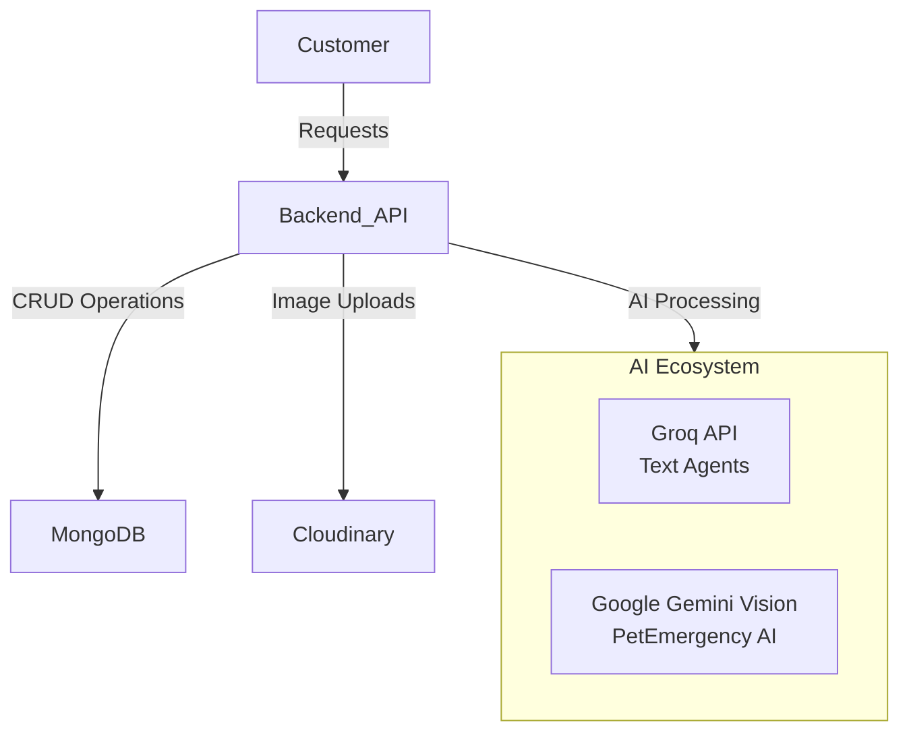
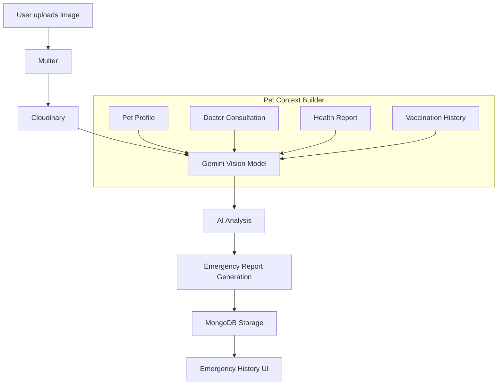

# 🐾 FurryFriend
### An AI-Powered Multi-Agent Pet Care Platform

<p align="center">
  
  
  
  
</p>

## 📖 Project Overview

**FurryFriend** is a full-stack MERN application that combines multiple specialized AI agents into a single, seamless pet care ecosystem. 

Designed for the modern pet owner, the platform provides an all-in-one suite to manage pets, consult veterinarians, analyze health conditions, receive nutrition recommendations, book grooming and boarding services, purchase pet products, and analyze emergency situations using advanced vision AI.

---

## 🛠️ Tech Stack

**Frontend**
- React
- Vite
- Tailwind CSS
- Redux Toolkit
- React Router
- Axios

**Backend**
- Node.js
- Express.js
- MongoDB
- Mongoose
- JWT Authentication
- Multer (File Uploads)

**Database & Storage**
- MongoDB / MongoDB Atlas
- Cloudinary (Cloud Image Storage)

**AI Architecture**
- Groq API (Text-Based AI Agents)
- Google Gemini Vision (PetEmergency AI)

---

## 🧠 Project Architecture

FurryFriend operates on a modular architecture to separate concerns and ensure scalability:



---

## 🤖 AI Agents Ecosystem

FurryFriend utilizes a **Hybrid AI Architecture** to ensure that each agent uses the most suitable model for its specific task. **Groq** powers all text-based AI agents, while **Google Gemini Vision** exclusively powers PetEmergency AI for rapid image analysis.

### 1. VetConnect AI
- Veterinary consultation assistant
- Appointment booking
- Doctor recommendations
- Medical guidance
- *Powered by:* **Groq**

### 2. PetHealth AI
- Generates health reports
- Tracks health history
- Calculates Health Score
- Personalized recommendations
- *Powered by:* **Groq**

### 3. NutriPaws AI
- Nutrition planning
- Feeding schedules
- Supplement recommendations
- Diet management
- *Powered by:* **Groq**

### 4. GroomEase AI
- Grooming recommendations
- Grooming appointments
- Grooming history tracking
- *Powered by:* **Groq**

### 5. TravelPaws AI
- Boarding recommendations
- Boarding appointments
- Boarding history tracking
- *Powered by:* **Groq**

### 6. PetCommerce AI
- Product recommendations
- Smart shopping assistant
- Personalized pet product discovery
- *Powered by:* **Groq**

### 7. PetEmergency AI
*Powered exclusively by:* **Google Gemini Vision**

#### Features:
- Image Analysis
- Emergency Severity assessment
- Immediate First Aid steps
- "Do Not Do" warnings
- Veterinary Recommendations
- Prevention Tips
- Emergency History & Reports

#### PetEmergency AI Pipeline:


---

## 👥 User Modules

- **Authentication:** Secure JWT-based login and registration.
- **Dashboard:** Centralized hub for all pet-related activities.
- **Pet Management:** Add, edit, and view pet profiles and histories.
- **Appointment Booking:** Seamlessly book vets, groomers, and boarding.
- **Emergency Analysis:** AI-powered visual emergency assessment.
- **Health Reports:** Ongoing health tracking and AI scoring.
- **Nutrition:** Diet and supplement planning.
- **Shopping:** AI-assisted commerce for pet supplies.
- **Profile:** Manage user account and settings.

---

## 🏥 Service Dashboards

### Clinic Dashboard
- **Clinic Login**
- **Appointments Management**
- **Consultation Form**
- **Consultation Summary**
- **Patient Records**
- **Clinic Profile**

### Grooming Dashboard
- **Grooming Dashboard Overview**
- **Appointments Management**
- **Grooming Report Generation**
- **Grooming Center Profile**

### Boarding Dashboard
- **Boarding Dashboard Overview**
- **Appointments Management**
- **Boarding Report Generation**
- **Boarding Center Profile**

---

## 🗄️ Database Collections

FurryFriend uses a structured NoSQL approach with the following key collections:

- `Users`
- `Pets`
- `Clinics`
- `Appointments`
- `Consultations`
- `HealthReports`
- `NutritionReports`
- `EmergencyReports`
- `EmergencyImages`
- `Products`
- `Orders`
- `GroomingCenters`
- `BoardingCenters`
- `Notifications`

---

## 🔒 Security

- **JWT Authentication:** Secure stateless session management.
- **Role-Based Authorization:** Strict access control (User, Clinic, Groomer, etc.).
- **Protected APIs:** Express middleware secures private routes.
- **Image Validation:** Secure processing of user uploads.
- **Environment Variables:** Credentials safely abstracted in `.env`.
- **Cloudinary Secure Upload:** Direct cloud integration prevents local malicious payload execution.

---

## 🚀 Installation & Setup

### Prerequisites
- Node.js (v18+)
- MongoDB (Local or Atlas)
- Cloudinary Account
- Groq API Key
- Google Gemini API Key

### 1. Clone Repository
```bash
git clone https://github.com/Mohamed-sabeek/FurryFriend.git
cd FurryFriend
```

### 2. Install Dependencies

**Backend:**
```bash
cd server
npm install
```

**Frontend:**
```bash
cd ../client
npm install
```

### 3. Environment Variables
Create a `.env` file inside the `server/` directory and configure the following:

```env
PORT=5000
MONGODB_URI=your_mongodb_connection_string
JWT_SECRET=your_jwt_secret_key

# Cloudinary Configuration
CLOUDINARY_CLOUD_NAME=your_cloud_name
CLOUDINARY_API_KEY=your_api_key
CLOUDINARY_API_SECRET=your_api_secret

# AI API Keys
GROQ_API_KEY=your_groq_api_key
GEMINI_API_KEY=your_gemini_api_key
```

### 4. Run the Application

**Run Backend (from `server/` directory):**
```bash
npm run dev
```

**Run Frontend (from `client/` directory):**
```bash
npm run dev
```

---

## 📁 Folder Structure

```
FurryFriend/
├── client/                  # React Frontend
│   └── src/
│       ├── components/      # Reusable UI components
│       ├── pages/           # Route views
│       ├── redux/           # State management
│       └── utils/           # Helper functions
│
└── server/                  # Node/Express Backend
    ├── controllers/         # Request handlers
    ├── middlewares/         # Auth and upload middleware
    ├── models/              # Mongoose schemas
    ├── routes/              # API endpoints
    ├── scripts/             # Diagnostic and utility scripts
    ├── services/            # Core business logic
    │   └── AI/              # AI Clients (groqClient.js, geminiClient.js)
    └── uploads/             # Temporary local upload storage
```

---

## ✨ Key Features

- **Modern UI:** Built with React, Tailwind CSS, and Framer Motion.
- **Role-Based Dashboards:** Unique experiences for Users, Clinics, Groomers, and Boarding Centers.
- **AI Powered Recommendations:** Multi-agent insights utilizing Groq.
- **Pet Medical History:** Comprehensive timeline and health tracking.
- **Emergency Image Analysis:** Visual triage using Google Gemini Vision.
- **Cloud Image Storage:** High-performance media delivery via Cloudinary.
- **MongoDB Integration:** Scalable, flexible data structures.
- **Multi-Agent Architecture:** Isolated, domain-specific AI logic.
- **Scalable Backend:** Express architecture designed for growth.
- **Responsive Design:** Flawless mobile and desktop experiences.

---

## 🔮 Future Enhancements

- [ ] **Real-time Chat:** Instant messaging between users and clinics.
- [ ] **Video Consultation:** Integrated telehealth for veterinarians.
- [ ] **AI Disease Prediction:** Preemptive risk analysis based on historical trends.
- [ ] **Wearable Integration:** Sync health data from smart collars.
- [ ] **Vaccination Reminders:** Automated push/email notifications.
- [ ] **Voice Assistant:** Hands-free pet care logging.
- [ ] **Mobile Application:** Dedicated iOS and Android native apps.

---

## 📝 License

This project is licensed under the **MIT License**.

---

## 👨‍💻 Author

**[Mohamed Sabeek]**
- GitHub: [@Mohamed-sabeek](https://github.com/Mohamed-sabeek)
- LinkedIn: https://www.linkedin.com/in/mohamed-sabeek-1a272a327/
- Portfolio: https://myportfolio-alpha-gules-77.vercel.app/
